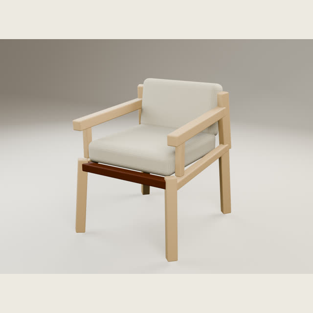
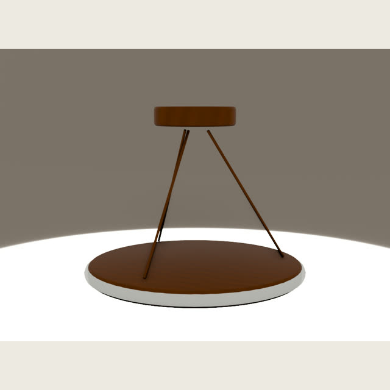
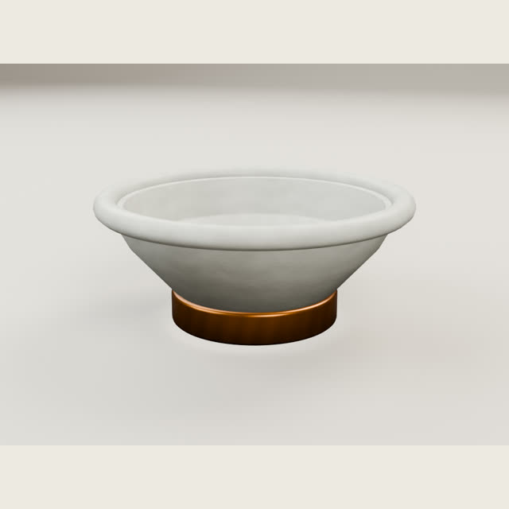

# GenHome3D-1280

**A benchmark of how an AI-assisted pipeline draws and constructs 1,280
household and spatial-design objects in 3D.**

[Explore the visual catalog](https://lx2026.github.io/genhome3d-1280/) ·
[Compare models on the bench](https://lx2026.github.io/genhome3d-1280/bench.html) ·
[Browse on Hugging Face](https://huggingface.co/datasets/linxy97/genhome3d-1280) ·
[Download release archives](https://github.com/lx2026/genhome3d-1280/releases) ·
[Read the generation method](METHOD.md) ·
[Read the technical checks](VALIDATION.md)

<table>
  <tr>
    <td></td>
    <td></td>
    <td></td>
  </tr>
</table>

## At a glance

| | |
|---|---:|
| Assets | 1,280 |
| Categories | 64 |
| Assets per category | 20 |
| Runtime format | USDZ |
| Units | Meters |
| Asset license | CC BY 4.0 |
| Original AI references | 1,280 |
| Automated package checks | 1,280/1,280 recorded |
| Vision Pro device review | Pending |

GenHome3D-1280 records the output of one repeatable AI-assisted pipeline across
seating, tables, bedroom furnishings, cabinetry,
office, entryway, kids, outdoor, lighting, bathroom, decor, textiles,
cookware, tableware, and appliances. Each category contains exactly 20 assets
with stable IDs, authored dimensions, searchable metadata, an original AI
reference, a generated preview, and a self-contained USDZ package. No object here
carries a visual review: the published checks are automated, and nobody has
inspected these results by eye.

## Model bench

The catalog is one pipeline's output. A bench gives the same reference image to
more than one model and publishes every build side by side, with the checks it
passed and the ones it did not.

There are 68 benches, one design target per category. In each, the catalog asset
was built by GPT-5.6 Sol inside that category's twenty-asset run, and the second
build was made by Claude Opus 5 from the reference image alone, with no shared
category geometry. Both normalise to the same declared envelope, so a bench shows
interpretation rather than size.

The Opus 5 builds were audited against their references after the fact, which
found 60 construction defects across 39 of the 68. Thirteen made an object
unreadable — a kettle handle attached to nothing, forks with no tines — and were
repaired by the same model that built them. The other 42 stay in the published
builds. Every one is listed in
[`reports/bench-visual-qc.md`](reports/bench-visual-qc.md), fixed and outstanding
alike. A bench that quietly repaired one model's misses would not measure
anything.

Each build opens as an interactive USDZ next to the reference image, the same
viewer the catalog uses.

Bench rebuilds are not part of the 1,280-asset dataset. They are excluded from
the category counts, the catalog indexes, and `checksums.sha256`, and ship under
`assets/benchmarks/` with their own records in
[`benchmarks.json`](benchmarks.json). Model names come from the production bench
registry; each entry also reports the attribution its own metadata sealed at
build time. No bench assigns a score.

## Download

Download individual assets directly from [`assets/`](assets) or the
[Hugging Face mirror](https://huggingface.co/datasets/linxy97/genhome3d-1280),
or use the complete archive attached to the latest GitHub release.

```bash
# Clone the full collection (approximately 1.2 GB including previews)
git clone --depth 1 https://github.com/lx2026/genhome3d-1280.git

# Verify every USDZ package
cd genhome3d-1280
sha256sum --check checksums.sha256
```

The compact [`catalog.json`](catalog.json) and [`catalog.csv`](catalog.csv)
indexes contain IDs, titles, category paths, dimensions, geometry counts,
download URLs, file sizes, checksums, and technical check results.

## Repository layout

```text
assets/<group>/<category>/<slug>.usdz       Runtime packages
metadata/<group>/<category>/<slug>.json     Per-asset records
previews/<group>/<category>/<slug>.jpg      Optimized hero previews
references/<group>/<category>/<slug>.jpg    Original AI design references
assets/benchmarks/<bench>/<entry>.usdz      Bench build packages
previews/benchmarks/<bench>/<entry>.jpg     Bench build previews
references/benchmarks/<bench>.jpg           Bench reference images
benchmarks.json                             Bench records
catalog.json                                Complete machine-readable catalog
catalog.csv                                 Flat analysis-friendly catalog
checksums.sha256                            USDZ integrity manifest
reports/publication-audit.json              Publication gate result
METHOD.md                                   Generation and review workflow
site/                                       GitHub Pages source
tools/build_publication.py                  Reproducible export script
```

## RealityKit and visionOS

The USDZ packages are self-contained, meter-authored, and checked for stage
integrity, archive safety, texture resolution, bounds, and placement. They are
suited to RealityKit-oriented prototyping and asset-pipeline research.

This release does **not** claim Apple Vision Pro device certification. The
asset-local production records mark on-device Vision Pro review as pending.
Always test the objects you ship in Reality Composer Pro and on your target
hardware.

## Attribution

When redistributing or adapting the assets, credit:

> GenHome3D-1280 contributors — https://github.com/lx2026/genhome3d-1280

See [`LICENSE-ASSETS`](LICENSE-ASSETS) for the asset license and
[`LICENSE`](LICENSE) for the software and site license.

## Provenance and limitations

The collection was created through an OpenAI Codex-assisted design,
specification, procedural Blender construction, packaging, and QA workflow.
Generated design references guided production and are published beside the
result so the benchmark can be inspected directly. See [`METHOD.md`](METHOD.md) for the production
workflow, [`PROVENANCE.md`](PROVENANCE.md) for origin and disclosure details,
and [`VALIDATION.md`](VALIDATION.md) for the technical checks and their limits.

The assets are generated designs, may not be unique, and should not be treated
as scans or authoritative replicas of real products. Review trademark, trade
dress, safety, accessibility, and regulatory requirements for your use case.

## Citation

Citation metadata is available in [`CITATION.cff`](CITATION.cff).
