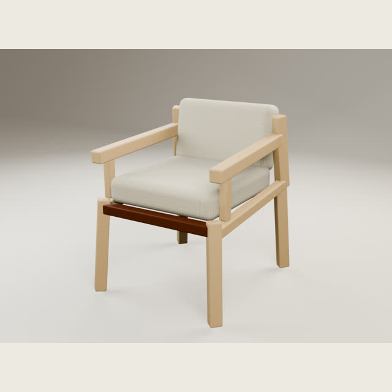
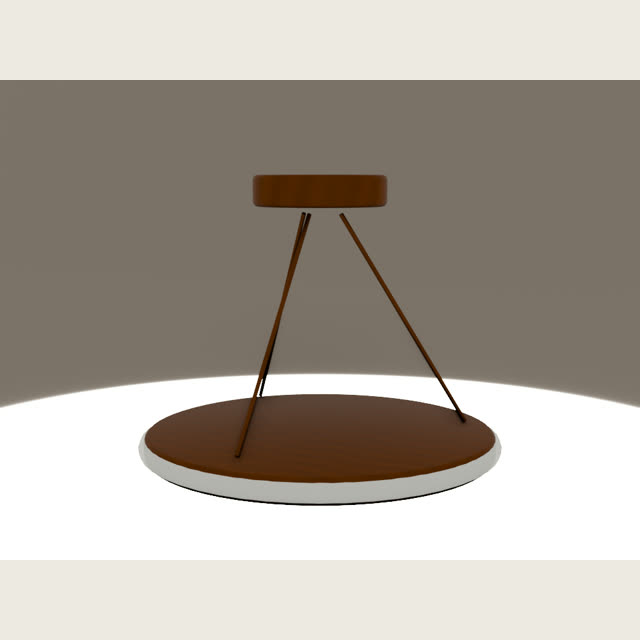
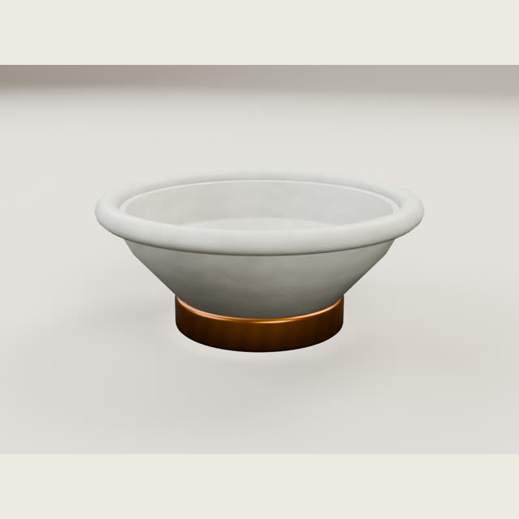

# GenHome3D-1280

**A benchmark of how an AI-assisted pipeline draws and constructs 1,280
household and spatial-design objects in 3D.**

[Explore the visual catalog](https://lx2026.github.io/genhome3d-1280/) ·
[Compare models on the bench](https://lx2026.github.io/genhome3d-1280/bench.html) ·
[Browse on Hugging Face](https://huggingface.co/datasets/linxy97/genhome3d-1280) ·
[Download release archives](https://github.com/lx2026/genhome3d-1280/releases) ·
[Read the generation method](METHOD.md) ·
[Read the technical checks](VALIDATION.md)

<table>
  <tr>
    <td></td>
    <td></td>
    <td></td>
  </tr>
</table>

## At a glance

| | |
|---|---:|
| Assets | 1,280 |
| Categories | 64 |
| Assets per category | 20 |
| Runtime format | USDZ |
| Units | Meters |
| Asset license | CC BY 4.0 |
| Original AI references | 1,280 |
| Automated package checks | 1,280/1,280 recorded |
| Vision Pro device review | Pending |

GenHome3D-1280 records the output of one repeatable AI-assisted pipeline across
seating, tables, bedroom furnishings, cabinetry,
office, entryway, kids, outdoor, lighting, bathroom, decor, textiles,
cookware, tableware, and appliances. Each category contains exactly 20 assets
with stable IDs, authored dimensions, searchable metadata, an original AI
reference, a generated preview, and a self-contained USDZ package. No object here
carries a visual review: the published checks are automated, and nobody has
inspected these results by eye.

## Model benchmark

[Compare the models](https://lx2026.github.io/genhome3d-1280/bench.html) by shared
reference, model, room, or category. The page contains **1,319 comparisons and
2,854 builds**. GPT-6 Astra covers every object in the original 64-category
expansion; the 39 additional comparisons preserve earlier chair, dining-table,
and bed benchmarks.

| Model | Published builds | Authoring method |
|---|---:|---|
| GPT-6 Astra | 1,280 | Full-library run with newly authored category helpers, parallel agents and targeted corrections |
| GPT-5.6 Sol | 1,319 | Original builds with shared category code; model name declared by the registry |
| Claude Opus 5 | 241 | Individual reference-led builds |
| Claude Fable 5 | 14 | Individual reference-led builds |

Each comparison shows its fixed reference, available model builds, rear views,
geometry and package checks, and individual USDZ downloads. Selecting a model
filters to references it actually completed; it does not imply equal coverage.
The original catalog remains exactly 1,280 objects. Benchmark additions stay
outside its category counts, indexes and `checksums.sha256`.

Astra's first complete production pass on DGX Spark took **236.08 minutes**
(5.42 assets/minute) with **94.26% mean observed GPU utilization**. Completion
through later corrections and final integrity verification took **19h52m**,
including an overnight usage-limit interruption. These are measurements of
this run, not a controlled speed comparison against the earlier models. See
[the run record](reports/astra-2026-09-26.json) for timing, hardware and limitations.

The published Astra assets are the final corrected versions. Original references
and dimensions remain fixed, while fine carving, textile structure, material
appearance and some proportions remain approximate. No model receives a score
or independent human-acceptance claim.

The historical inspection of the first 68 Opus 5 builds remains available in
[`reports/bench-visual-qc.md`](reports/bench-visual-qc.md) and attached to the same
entries in [`benchmarks.json`](benchmarks.json): 60 findings across 39 builds,
18 fixed and 42 retained. That earlier audit is not a comparable score for the
other runs. Each build also retains its sealed attribution; the original
catalog metadata recorded OpenAI Codex without a model version.

USDZ files load on demand from this repository's existing raw-content host.
The Pages site contains the previews and comparison records, keeping its
published artifact below the hosting size limit.

## Download

Download individual catalog and model-benchmark assets directly from
[`assets/`](assets) or from the website. The
[Hugging Face mirror](https://huggingface.co/datasets/linxy97/genhome3d-1280)
and existing release archives provide the original 1,280-object catalog;
additional model runs are available through the benchmark page and this repository.

```bash
# Clone the catalog and published model benchmark runs
git clone --depth 1 https://github.com/lx2026/genhome3d-1280.git

# Verify the original catalog packages
cd genhome3d-1280
sha256sum --check checksums.sha256
```

The compact [`catalog.json`](catalog.json) and [`catalog.csv`](catalog.csv)
indexes contain IDs, titles, category paths, dimensions, geometry counts,
download URLs, file sizes, checksums, and technical check results.

## Repository layout

```text
assets/<group>/<category>/<slug>.usdz       Runtime packages
metadata/<group>/<category>/<slug>.json     Per-asset records
previews/<group>/<category>/<slug>.jpg      Optimized hero previews
references/<group>/<category>/<slug>.jpg    Original AI design references
assets/benchmarks/<bench>/<entry>.usdz      Bench build packages
previews/benchmarks/<bench>/<entry>.jpg     Bench build previews
references/benchmarks/<bench>.jpg           Bench reference images
benchmarks.json                             Bench records
catalog.json                                Complete machine-readable catalog
catalog.csv                                 Flat analysis-friendly catalog
checksums.sha256                            USDZ integrity manifest
reports/publication-audit.json              Publication gate result
METHOD.md                                   Generation and review workflow
site/                                       GitHub Pages source
tools/build_publication.py                  Reproducible export script
```

## RealityKit and visionOS

The USDZ packages are self-contained, meter-authored, and checked for stage
integrity, archive safety, texture resolution, bounds, and placement. They are
suited to RealityKit-oriented prototyping and asset-pipeline research.

This release does **not** claim Apple Vision Pro device certification. The
asset-local production records mark on-device Vision Pro review as pending.
Always test the objects you ship in Reality Composer Pro and on your target
hardware.

## Attribution

When redistributing or adapting the assets, credit:

> GenHome3D-1280 contributors — https://github.com/lx2026/genhome3d-1280

See [`LICENSE-ASSETS`](LICENSE-ASSETS) for the asset license and
[`LICENSE`](LICENSE) for the software and site license.

## Provenance and limitations

The collection was created through an OpenAI Codex-assisted design,
specification, procedural Blender construction, packaging, and QA workflow.
Generated design references guided production and are published beside the
result so the benchmark can be inspected directly. See [`METHOD.md`](METHOD.md) for the production
workflow, [`PROVENANCE.md`](PROVENANCE.md) for origin and disclosure details,
and [`VALIDATION.md`](VALIDATION.md) for the technical checks and their limits.

The assets are generated designs, may not be unique, and should not be treated
as scans or authoritative replicas of real products. Review trademark, trade
dress, safety, accessibility, and regulatory requirements for your use case.

## Citation

Citation metadata is available in [`CITATION.cff`](CITATION.cff).

## Website development

Run `npm ci` and `npm run build:site` to assemble the Pages artifact. Model
packages remain on the existing raw-content download host and load on demand.
For an unpublished local candidate, `npm run build:site -- --local-assets`
uses local packages; that mode is never deployed.

`npm run test:attached -- <site-url> <output-directory>` verifies the website
through the existing browser at `127.0.0.1:9222`. It creates and closes only its
own tab. The report distinguishes interactive rendering from package parsing
and fallback behavior when that browser has WebGL disabled. The regular
`npm run test:site` suite targets a browser with WebGL support.
