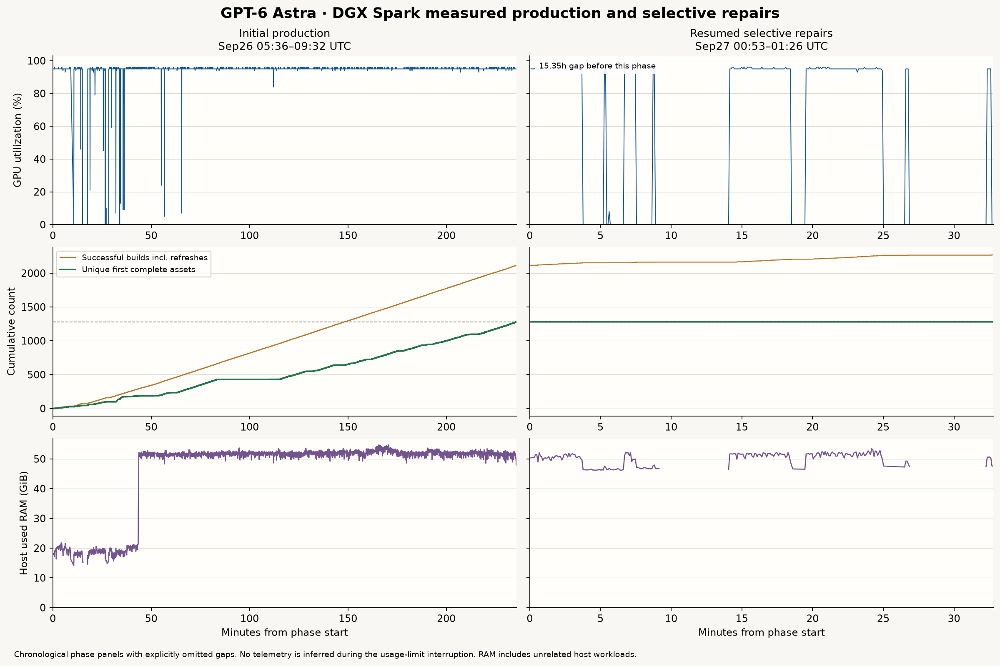

# GPT-6 Astra run context

GPT-6 Astra authored procedural geometry from the same authoritative references and declared dimensions, using shared Astra primitives and family builders. Multiple agents made iterative corrections before this final publication.

Published builds: **1,280** across **64** categories. Native renders are 1440×1080 Eevee at 256 samples; this site uses smaller JPEG copies. Packages preserve the completed USDZ bytes.

The first complete set took **236.08 minutes** (5.422 assets/minute), with **94.26%** mean observed GPU utilization. Wall time through final verification was **19.87 hours**, including a **15.35 hour** unobserved usage-limit interruption and later selective corrections.

Historical failed stage/source attempts: **6**. Unmatched initial stage-start records: **15**. Both remain in the accounting.

## Comparability and limits

- These are final revised outputs, not an untouched first-attempt sample. Historical Opus and Fable records remain as previously published; methods, hardware, rendering and correction budgets differ, so this is not a controlled model ranking.
- Technical checks do not establish visual fidelity or a quality score. No human or on-device certification is claimed.
- Declared dimensions can alter the silhouette relative to the picture. Fine ornament, wood/stone microtexture, fabric folds and some constructions remain simplified.
- Native Cycles could not run because its CUDA kernel rejected GB10 sm_121; images use Eevee. Transparent materials can look milkier or clearer than the reference. Eevee display alpha and exported USD opacity are not equivalent.
- The long unobserved interval contains a usage-limit interruption. GPU statistics cover observed samples; absent telemetry is not imputed. Host RAM includes unrelated workloads. Concurrency observations do not prove a causal speedup.

[Machine-readable run context](astra-2026-09-26.json)

